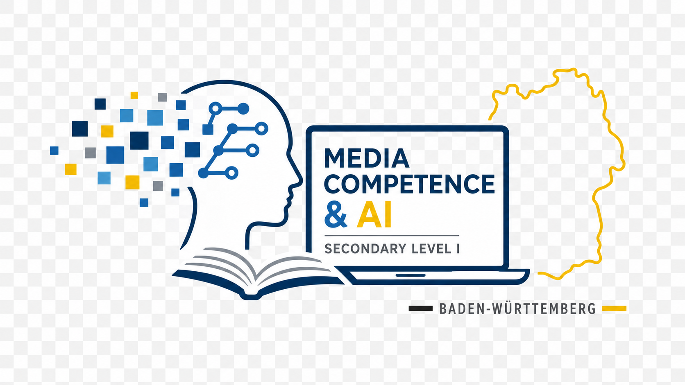

<!--
README für: Entwicklung der Medienkompetenz in der Sek I – 
Neue Anforderungen durch die schulische Implementierung der KI
-->

[](https://www.buymeacoffee.com/highfish)

<div align="center">

# 🎓📚 Medienkompetenz & KI in der Sek I

**Entwicklung der Medienkompetenz in der Sekundarstufe I –  
Neue Anforderungen durch die schulische Implementierung der KI**

[](./)
[](./)
[](./)
[](./)
[](https://creativecommons.org/licenses/by-nc-sa/4.0/)

</div>

---
<div align="center">
  
</div>
---

## 🎯 Projektüberblick

Dieses Repository bündelt die Materialien einer Seminararbeit zum Thema:

> **„Entwicklung der Medienkompetenz in der SEK I – Neue Anforderungen durch die schulische Implementierung der KI“**  
> mit besonderem Fokus auf den **Bildungsplan 2016 Baden‑Württemberg**, die **Leitperspektive Medienbildung (MB)** und aktuelle KI‑Entwicklungen im schulischen Kontext (KM BW, KMK, ZSL, LMZ, UNESCO, DigCompEdu).

Ziel ist es, eine **wissenschaftlich fundierte, praxisnahe Grundlage** für die Unterrichts- und Schulentwicklung im Bereich Medienbildung & KI bereitzustellen – insbesondere für Realschulen der Sekundarstufe I in Baden‑Württemberg. 🤖🏫

---

## 📁 Repository-Struktur

```text
.
├── Kapitel_00_Gliederung/
│   └── 00_GLIEDERUNG.md        # Vollständige Gliederung mit Seitenverteilung & Leitfragen
├── Kapitel_1/
│   └── 01_EINLEITUNG.md        # Ausformulierte Einleitung der Seminararbeit
├── Kapitel_2/
│   ├── 02_Kapitel_2.1.md
│   ├── 02_Kapitel_2.2.md
│   ├── 02_Kapitel_2.3.md
│   └── 02_InfografikKapitel2.png
├── Kapitel_3/
│   ├── 03_Kapitel_3.1.md
│   ├── 03_Kapitel_3.2.md
│   └── 03_InfografikKapitel3.png
├── Kapitel_4/
│   ├── 04_Kapitel_4.1.md
│   └── 04_InfografikKapitel4.png
├── Kapitel_5/
│   ├── 05_Kapitel.5.1.md
│   └── 05_InfografikKapitel5.png
├── Kapitel_6/
│   ├── 06_Kapitel_6.1.md
│   └── 06_InfografikKapitel6.png
├── Kapitel_7/
│   └── 07_Literaturverzeichnis.md
├── Kapitel_99/
│   └── 99_QUELLEN.md           # Konsolidierte Quellenbasis (Bücher + Onlinequellen)
├── /additional/                # Zusätzliche Materialien (Blogposts, Berichte, Fortbildungsangebote)
├── /docs/                      # Grafiken, Visualisierungen und weitere Dokumente
│   ├── img/
│   └── doc.md
├── LICENSE
├── README.md                   # Diese Projektübersicht
└── CONTRIBUTING.md             # (optional) Richtlinien zur Mitwirkung
```

> Hinweis: Die Inhalte sind nun in kapitelweise organisierten Ordnern strukturiert. Jeder Kapitel-Ordner enthält die Markdowndateien sowie zugehörige Infografiken und Visualisierungen.

---

## 🧩 Inhalte im Detail

### 1️⃣ EINLEITUNG.md

- Heranführung an das Thema **Künstliche Intelligenz in der Schule**  
- Problemstellung: **Reicht die bisherige Medienkompetenz-Konzeption im Zeitalter von KI?**
- Forschungsfrage:  
  *„Welche neuen Anforderungen stellt die schulische Implementierung von KI an die Medienkompetenzentwicklung in der Sekundarstufe I, und wie können diese im Rahmen des Bildungsplans 2016 BW umgesetzt werden?“*
- Überblick über Aufbau und Zielsetzung der Arbeit

👉 Ideal, um schnell in das Thema einzusteigen oder die Arbeit in einer Präsentation vorzustellen.

---

### 2️⃣ GLIEDERUNG.md

- **Komplette Struktur** der Arbeit (Kapitel 1–8) mit:
  - Seitenverteilung (Ziel: ca. 30 Seiten)
  - inhaltlichen Leitfragen pro Kapitel
  - beispielhaften Quellenhinweisen (KMK, KM BW, ZSL, LMZ, UNESCO, DigCompEdu, Tulodziecki, Kerres, Buchner/Freisleben‑Teutscher)
- Logische Gliederung in:
  - Theorieteil (Medienkompetenz, Medienbildung, KI‑Grundlagen)
  - Rahmenbedingungen in BW (KM, ZSL, LMZ, Medienzentrenverbund)
  - internationale Einordnung (UNESCO, DigCompEdu)
  - **Transferteil** mit konkreten Unterrichts- und Schulentwicklungsbeispielen (ca. 30 % der Arbeit)

👉 Das Dokument ist dein „roter Faden“ – perfekt als Vorlage für die eigentliche Ausarbeitung.

---

### 3️⃣ QUELLEN.md

- Sammelverzeichnis der wichtigsten **Bücher und Onlinequellen**:
  - Standardwerke zur Medienbildung (z. B. Tulodziecki/Herzig/Grafe, Kerres)
  - KI im Unterricht (z. B. Buchner/Freisleben‑Teutscher)
  - Bildungsplan 2016 / Basiskurs Medienbildung / Leitperspektive MB
  - KMK‑Strategie „Bildung in der digitalen Welt“
  - DigCompEdu (EU)
  - UNESCO „AI and Education: Guidance for Policy-makers“
  - zentrale Dokumente von KM BW, ZSL, LMZ, SMZ
- Format in einfachem Markdown, gut in ein Literaturverzeichnis (z. B. APA) überführbar

👉 Dient als belastbare Quellenbasis für Hausarbeiten, Seminararbeiten oder Fortbildungen.

---

## 🖼️ Grafiken & Visualisierungsideen

Um das Repository „bunt“ und anschaulich zu gestalten, kannst du im Ordner `docs/img` eigene Grafiken ergänzen und hier einbinden:

```markdown


```

**Vorschläge für Visuals:**

- Mindmap zu *Medienkompetenz vs. KI-Kompetenz (AI Literacy)*
- Schema zur Verknüpfung von **BP 2016 → Leitperspektive MB → Unterrichtseinheiten zu KI**
- Ablaufschema für die Unterrichtsreihe im Transferteil (Kapitel 6)

---

## 🚀 Nutzung & Anpassung

Dieses Repository kann u. a. genutzt werden für:

- die **eigene Seminararbeit / Hausarbeit** zur Thematik Medienbildung & KI
- die Vorbereitung von **Unterrichtseinheiten** zu KI in der Sek I (Basiskurs Medienbildung, Informatik, Deutsch, WBS, Technik)
- **Fortbildungen** im Kollegium zum Umgang mit KI im Unterricht
- die konzeptionelle Arbeit an einem **Medienentwicklungsplan** mit KI-Schwerpunkt

### Wie du es an deine Schule anpasst

1. `GLIEDERUNG.md` prüfen und ggf. Kapitel an die eigene Schulart/Fächer anpassen  
2. `EINLEITUNG.md` als Vorlage nutzen und schul-/kontextbezogen ergänzen  
3. `QUELLEN.md` mit weiteren lokalen Quellen erweitern (z. B. eigene Schulprojekte, SMZ‑Material)  
4. Eigene **Unterrichtsentwürfe, Materialien und Folien** im Ordner `docs/` hinzufügen  

---

## 🧪 Technischer Einsatz (optional)

Wenn du das Repo z. B. in Verbindung mit Markdown‑Tools oder GitHub Pages nutzen willst:

```bash
# Repository klonen
git clone https://github.com/<USER>/<REPO-NAME>.git
cd <REPO-NAME>

# Markdown lokal ansehen (z. B. mit VS Code + Markdown Preview)
code .
```

Optional kannst du GitHub Pages aktivieren und die Dokumentation (z. B. aus `docs/`) als kleine Website bereitstellen.

---

## 📜 Lizenz

Sofern nicht anders angegeben, stehen die Inhalte dieses Repositories unter der Lizenz:

> **Creative Commons Attribution-NonCommercial-ShareAlike 4.0 International (CC BY-NC-SA 4.0)**

Das bedeutet:

- ✅ **Teilen & Anpassen** für nicht-kommerzielle Zwecke erlaubt  
- ❗ Namensnennung erforderlich  
- 🔁 Abgeleitete Werke müssen unter derselben Lizenz weitergegeben werden  

Details: https://creativecommons.org/licenses/by-nc-sa/4.0/

---

## 💬 Kontakt & Mitwirkung

Wenn du:

- Ideen für weitere **Unterrichtsbeispiele** mit KI in der Sek I hast,
- das Konzept für eine andere Schulart adaptierst,
- oder Ergänzungen zu **Quellen / Tools / Fortbildungen** in BW kennst,

freue ich mich über Issues oder Pull Requests. 🙌

> *„Schulen müssen Orte werden, an denen KI nicht nur genutzt, sondern verstanden und kritisch reflektiert wird.“*

