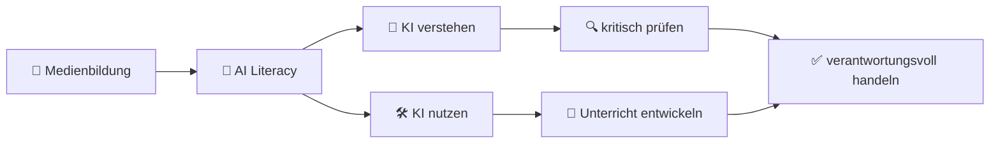
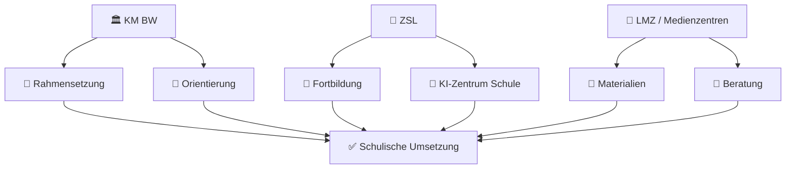
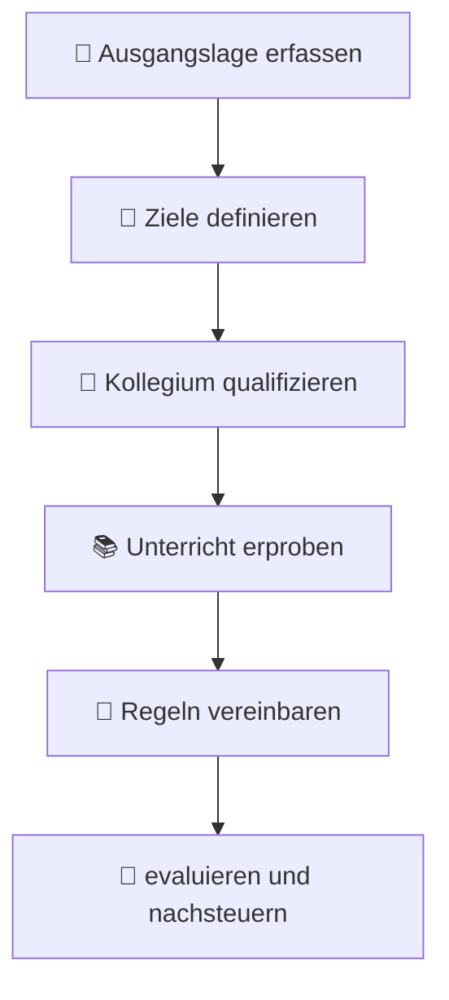

# 🎓 Medienkompetenz und Künstliche Intelligenz in der Sekundarstufe I
## Strategische Implementierung in Baden-Württemberg

> [!TIP]
> Dieses Dokument bietet eine praxisorientierte, schulbezogene und strategische Einordnung zur Verbindung von **Medienkompetenz** und **Künstlicher Intelligenz** in der Sekundarstufe I in Baden-Württemberg.[1][2][3]

***

## 🌟 Executive Summary

Die Integration von Künstlicher Intelligenz in Schule und Unterricht ist in Baden-Württemberg zu einer konkreten Entwicklungsaufgabe geworden. Der Bildungsplan 2016 verankert Medienbildung bereits verbindlich als Leitperspektive in allen Fächern, während neuere Unterstützungsangebote des Kultusministeriums, des ZSL und des LMZ die Auseinandersetzung mit KI systematisch erweitern.[1][4][2][3][5]

Für die Sekundarstufe I bedeutet das eine doppelte Perspektive: KI muss sowohl als **Lerngegenstand** verstanden als auch als **Lernwerkzeug** reflektiert eingesetzt werden. Erfolgreich ist die Implementierung dann, wenn sie Unterrichtsentwicklung, Fortbildung, Datenschutz, Leistungsbewertung und schulische Regelsetzungen miteinander verbindet.[1][6][3][7]



***

## 🧠 1. Theoretischer Rahmen

### 1.1 Medienkompetenz im Wandel

Medienkompetenz ist weiterhin die zentrale Grundlage schulischer Bildung in einer digital geprägten Welt. Durch generative KI erweitert sich dieser Begriff jedoch um neue Anforderungen wie das Prüfen von KI-Ausgaben, das Erkennen von Verzerrungen und das Verstehen algorithmischer Logiken.[1][7]

Damit verschiebt sich der Fokus von bloßer Anwendungskompetenz hin zu einer vertieften Medienbildung. Lernende sollen digitale Werkzeuge nicht nur bedienen, sondern deren Funktionsweise, Grenzen und gesellschaftliche Folgen reflektieren.[2][7]

> [!IMPORTANT]
> **AI Literacy** ergänzt klassische Medienkompetenz um Urteilsfähigkeit gegenüber KI-generierten Inhalten, Transparenzfragen, Bias, Halluzinationen und automatisierten Entscheidungen.[1][7][8]

### 1.2 Verankerung im Bildungsplan 2016

Die Leitperspektive Medienbildung ist im Bildungsplan 2016 Baden-Württemberg verbindlich in allen Fächern verankert. Sie bildet damit die curriculare Grundlage, um auch KI-bezogene Fragestellungen in der Sekundarstufe I systematisch einzubinden.[4][2][9]

Der Basiskurs Medienbildung in Klasse 5 schafft einen geeigneten Einstieg, um frühe Grundvorstellungen über Daten, digitale Systeme und erste KI-Beispiele anzubahnen. Gleichzeitig zeigt sich eine Spannung zwischen der Dynamik neuer KI-Werkzeuge und der vergleichsweise langsamen Fortschreibung formaler Bildungspläne.[1][2][9]

***

## 🤖 2. KI: Grundlagen und pädagogische Relevanz

### 2.1 Was Schülerinnen und Schüler verstehen sollten

Für die Sekundarstufe I ist ein altersangemessenes Verständnis zentral, dass KI-Systeme auf Daten, Mustern und Wahrscheinlichkeiten beruhen. Gerade generative Systeme erzeugen sprachlich überzeugende Ergebnisse, ohne Wahrheit garantieren zu können.[1][7]

Daraus folgt ein didaktischer Schwerpunkt auf Begriffe wie Trainingsdaten, Mustererkennung, Wahrscheinlichkeitslogik und Fehleranfälligkeit. Nur so können Schülerinnen und Schüler Halluzinationen, stereotype Ausgaben oder scheinbar plausible Falschinformationen einordnen.[1][7][8]

### 2.2 Chancen und Risiken im Überblick

| Dimension | Chancen | Risiken |
|---|---|---|
| Lernen | Individualisierung, direktes Feedback, niedrigschwellige Unterstützung bei Sprache und Strukturierung.[1] | Abhängigkeit von Tools, geringere Eigenleistung, Verlust grundlegender Kompetenzen.[1][7] |
| Lehrkraft | Entlastung bei Planung, Materialerstellung und Differenzierung.[1][3] | Fortbildungsbedarf, Rollenwandel, neue Anforderungen an Bewertung und Diagnostik.[1][3][7] |
| Gesellschaft | Vorbereitung auf eine KI-geprägte Lebens- und Arbeitswelt.[5][7] | Datenschutzprobleme, Bias, Deepfakes, Desinformation und ungleiche Teilhabe.[1][7][8] |

> [!WARNING]
> Der pädagogische Mehrwert von KI entsteht nicht automatisch durch Tool-Einsatz, sondern durch didaktische Rahmung, Aufgabenqualität und reflektierte Nutzung.[1][7]

***

## 🏛️ 3. Steuerung und Unterstützung in Baden-Württemberg

### 3.1 Rolle des Kultusministeriums

Das Kultusministerium Baden-Württemberg stellt Informationen und Orientierungshilfen zum KI-Einsatz im Unterricht bereit. Dabei wird deutlich gemacht, dass KI grundsätzlich pädagogisch genutzt werden kann, die Verantwortung für Bewertung, Auswahl und Einordnung aber bei der Lehrkraft bleibt.[1]

Zugleich knüpft das Ministerium an die bestehende Leitperspektive Medienbildung an und schafft damit einen verbindenden Rahmen zwischen digitaler Bildung und aktueller KI-Entwicklung.[1][2]

### 3.2 Professionalisierung durch das ZSL

Das Zentrum für Schulqualität und Lehrerbildung bündelt Unterstützungsangebote zum Thema KI und hat dafür das **KI-Zentrum Schule** aufgebaut. Dieses Zentrum soll Expertise, Fortbildung und Transfer für Schulen systematisch zusammenführen.[6][3][5]

Der Standort Heilbronn am IPAI verweist darauf, dass Baden-Württemberg KI-Bildung auch als Innovationsfeld der Schulentwicklung versteht. Damit werden nicht nur Einzelveranstaltungen angeboten, sondern längerfristige Professionalisierungsstrukturen geschaffen.[3][5]

### 3.3 Unterstützung durch LMZ und Medienzentren

Das Landesmedienzentrum Baden-Württemberg bietet Fortbildungen, Selbstlernangebote und medienpädagogische Materialien an. Dazu gehören auch schulpraktische Formate für Lehrkräfte und Lernende, die an den Kompetenzaufbau in der Sekundarstufe I anschließen.[10][11][12]

Für Schulen ist besonders bedeutsam, dass diese Angebote durch regionale Medienzentren ergänzt werden. Dadurch entstehen niedrigschwellige Beratungs- und Unterstützungsstrukturen für Unterricht und Schulentwicklung.[12]



***

## 🌍 4. Internationale und europäische Perspektiven

Die strategische Entwicklung in Baden-Württemberg lässt sich in größere Rahmenwerke einordnen. Die KMK-Strategie „Bildung in der digitalen Welt“ beschreibt sechs Kompetenzbereiche für Lernende und ist damit ein wichtiger Referenzrahmen für schulische Digitalisierung in Deutschland.[13]

Für Lehrkräfte bietet DigCompEdu einen europäischen Bezugsrahmen mit 22 Kompetenzen in sechs Bereichen. Dieser Rahmen eignet sich besonders, um Fortbildungsbedarfe zu analysieren und schulische Professionalisierung systematisch zu planen.[14][15][16]

UNESCO betont in ihren Leitlinien zu KI und Bildung menschenrechtliche, faire und inklusive Bedingungen. Im Mittelpunkt stehen Datenschutz, Transparenz, pädagogische Verantwortung und die Vermeidung neuer Bildungsungleichheiten.[7][8]

> [!NOTE]
> Internationale Rahmenwerke liefern keine fertigen Unterrichtseinheiten, aber sie helfen Schulen dabei, ihre Entwicklungsziele, Qualitätskriterien und Fortbildungsstrategien zu schärfen.[14][7][13]

***

## 🏫 5. Transfer in die Schulpraxis

### 5.1 Unterrichtsbeispiele für die Sekundarstufe I

| Klassenstufe | Thema | Mögliche Umsetzung | Kompetenzschwerpunkt |
|---|---|---|---|
| 5/6 | Was ist KI? 🤔 | Stationenlernen, Sortieraufgaben, einfache Chatbot-Experimente | Grundverständnis, Fragen stellen, Ergebnisse prüfen |
| 7/8 | KI im Alltag 📱 | Fallbeispiele zu Übersetzung, Empfehlungssystemen, Bildgenerierung | Chancen und Grenzen erkennen |
| 8/9 | Deepfakes und Desinformation 🕵️ | Quellencheck, Vergleich echter und manipulierter Inhalte, Faktencheck-Protokolle | Medienkritik, Urteilskompetenz, Verantwortung |

Die Angebote des Kultusministeriums und des LMZ unterstützen solche Unterrichtsformate vor allem dort, wo Medienbildung, kritische Reflexion und digitale Werkzeuge zusammengeführt werden.[1][11][12]

### 5.2 Strategische Schulentwicklung

Eine tragfähige Schulstrategie sollte KI nicht isoliert behandeln, sondern in bestehende Entwicklungsprozesse integrieren. Besonders wichtig sind dabei Medienentwicklungsplan, Fortbildungskonzept, Datenschutzregelungen und transparente Absprachen zu Hausaufgaben sowie Leistungsnachweisen.[1][3][12][7]

**Empfohlene Entwicklungsschritte:**

- 🧭 KI als Entwicklungsfeld im Medienentwicklungsplan verankern.[2][12]
- 👩‍🏫 Fortbildungsbedarfe im Kollegium systematisch erfassen und staffeln.[3][14]
- 📜 Hausinterne Leitlinien für erlaubte und kennzeichnungspflichtige KI-Nutzung formulieren.[1][7]
- 🔐 Datenschutz und Tool-Auswahl verbindlich prüfen.[1][7][8]
- 🤝 Regionale Unterstützung durch Medienzentren und Landesangebote aktiv nutzen.[10][12]



***

## 📌 6. Zentrale Erkenntnisse

- Medienbildung in Baden-Württemberg bietet bereits ein tragfähiges Fundament für die Einbindung von KI-Themen.[4][2]
- Die aktuelle Entwicklung erfordert eine Erweiterung klassischer Medienkompetenz hin zu **AI Literacy**.[1][7]
- Erfolgreiche Umsetzung gelingt nur durch die Verbindung von Unterrichtsentwicklung, Fortbildung und schulischen Regelprozessen.[1][3][12]
- Baden-Württemberg verfügt mit KM, ZSL, KI-Zentrum Schule und LMZ über relevante Unterstützungsstrukturen.[1][3][12][5]
- Datenschutz, Bildungsgerechtigkeit und angemessene Prüfungsformate bleiben zentrale Zukunftsfragen.[1][7][8]

***

## 🎨 7. Direkt nutzbare Gestaltungselemente

### Farbige Hervorhebungen per HTML

```html
<span style="color:#1565c0;"><strong>Medienbildung</strong></span>
<span style="color:#2e7d32;"><strong>AI Literacy</strong></span>
<span style="color:#ef6c00;"><strong>Schulentwicklung</strong></span>
<span style="color:#c62828;"><strong>Datenschutz</strong></span>
```

### Callout-Ideen

> [!TIP]
> Für Konzeptionen in Fachschaften eignet sich eine Gliederung nach **Unterricht**, **Fortbildung**, **Regelsetzung** und **Evaluation** besonders gut.

> [!WARNING]
> Bei KI-Tools sollte nie nur der Bedienaspekt thematisiert werden. Entscheidend ist die Verbindung aus Nutzung, Reflexion und Bewertung.[1][7]

### Emoji-Legende

- 🤖 KI und Automatisierung  
- 🧠 Verstehen und Reflektieren  
- 🛡️ Datenschutz und Verantwortung  
- 🧭 Schulentwicklung und Strategie  
- 🎯 Kompetenzen und Lernziele  
- 🕵️ Desinformation und Deepfakes  

***

## 🖼️ 8. Titelbild-Platzhalter

```text
╔════════════════════════════════════════════════════════════════════╗
║ 🤖 Medienkompetenz & KI in der Sekundarstufe I                   ║
║ Strategische Implementierung in Baden-Württemberg                ║
║                                                                  ║
║ 📱 Medienbildung | 🧠 AI Literacy | 🏫 Schulentwicklung          ║
╚════════════════════════════════════════════════════════════════════╝
```

***

## 🔭 9. Ausblick

Die nächsten Jahre werden zeigen, wie gut Schulen die Balance zwischen Offenheit für Innovation und pädagogischer Verantwortlichkeit gestalten. Für Baden-Württemberg ist die Ausgangslage günstig, weil curriculare Verankerung, Landesangebote und Fortbildungsstrukturen bereits vorhanden sind.[1][2][3][12][5]

Entscheidend bleibt jedoch, dass KI nicht als kurzfristiger Trend, sondern als dauerhafte Bildungsaufgabe verstanden wird. Sekundarstufe I bedeutet in diesem Zusammenhang vor allem: Grundlagen legen, Urteilskraft stärken und verantwortliches Handeln anbahnen.[1][7][8]
